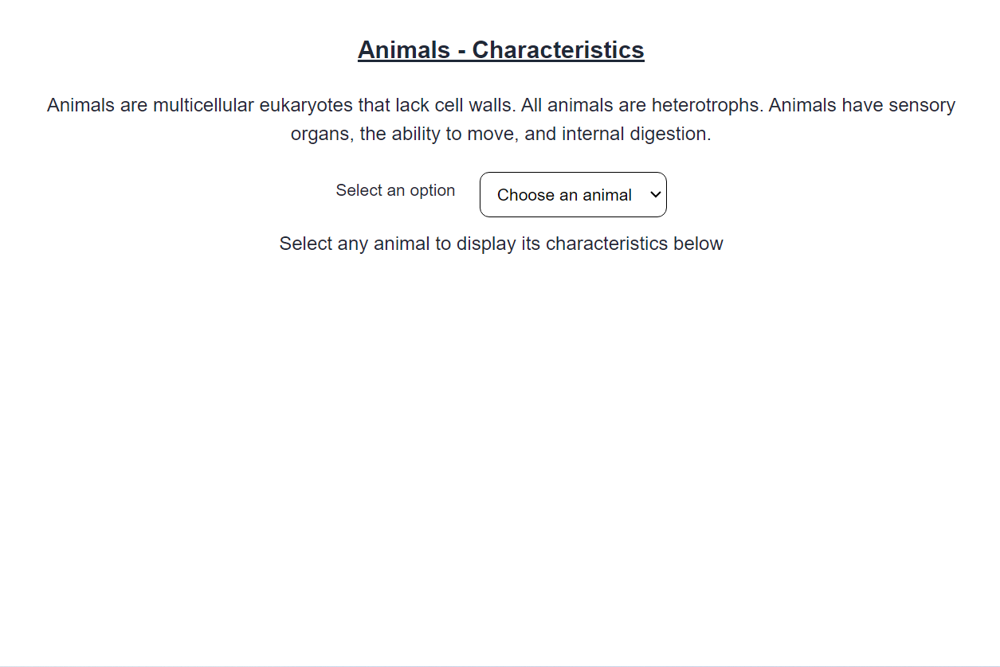
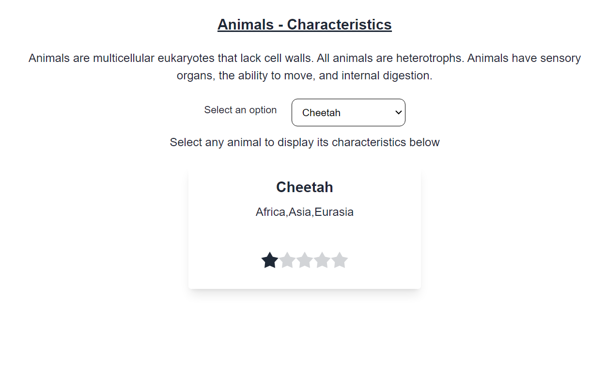
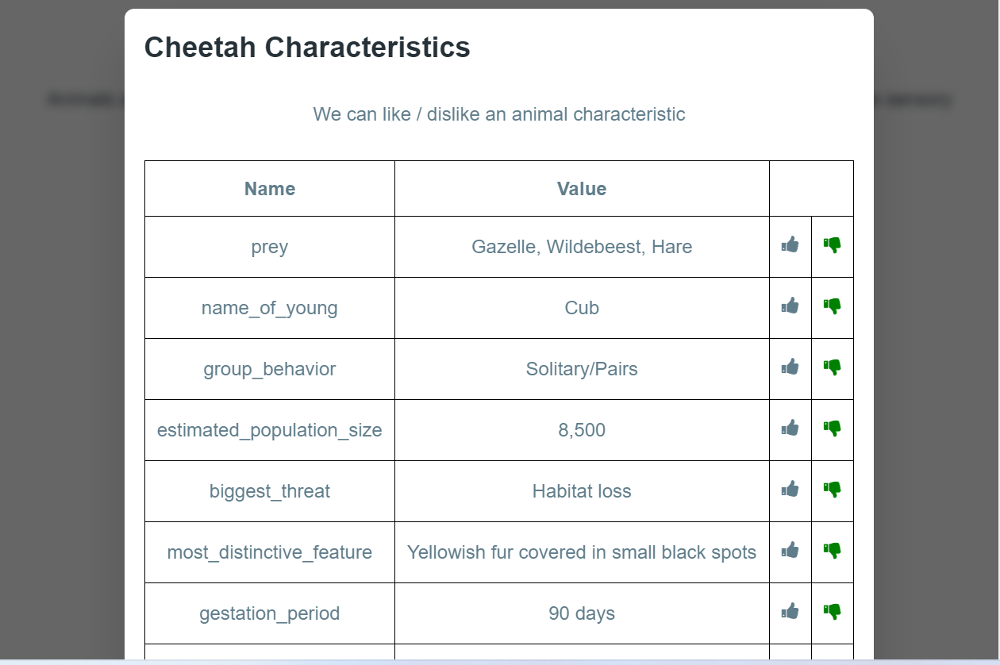
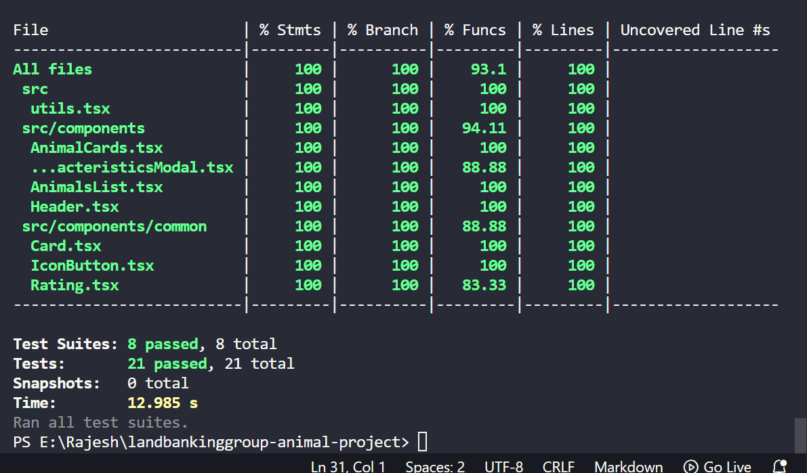

# React + TypeScript + Vite

# Animal Rating / Characteristics Like / Dislike
Website used for displaying the animal where we can display the rating
and like / dislike a characteristics

## Tech stack
 - React / Typescript / Javascript
 - react-testing-library
 - jest / React testing library
 - Redux / Redux Saga / Redux toolkit
 - Tailwind CSS (tried)
 - Vite (setup / configuration)
 - Local Storage

## Screenshots






## Important Details

1. Actual time taken to complete start to finish
-- 4 hrs

2. Thought process
-- Took some time to finalize the ui
-- Wanted to do it simpler and easier to maintain
-- Known bugs (localstorage was not updated when rating / like / dislike change)

3. Wishlist
Show a navbar with fav icon
On clicking tag all highly rated animals there
Add provision to support more animals (scalable ui)
UX can be improved a bit

### Running the app locally

To run the app, follow these steps.

1. Ensure that [NodeJS](http://nodejs.org/) is installed.
2. From the project folder, execute the following commands:

To clone the project
```shell
  git clone git@github.com:RajeshSivanesan/landbankinggroup-animail-project.git
  OR
  git clone https://github.com/RajeshSivanesan/landbankinggroup-animail-project.git
```

Move to the directory
```shell
  cd landbankinggroup-animail-project
```

To install dependencies:
```shell
  npm install
```

To run the app:

```shell
  npm run dev
```

To launch the ui:

```shell
  Please check the url which prints post npm run dev
  Default - http://localhost:5173/
  If the port is busy, it will pick the next one - 5174
  so always keep an eye on the port number
```

To run the tests:

```shell
  npm run test
```